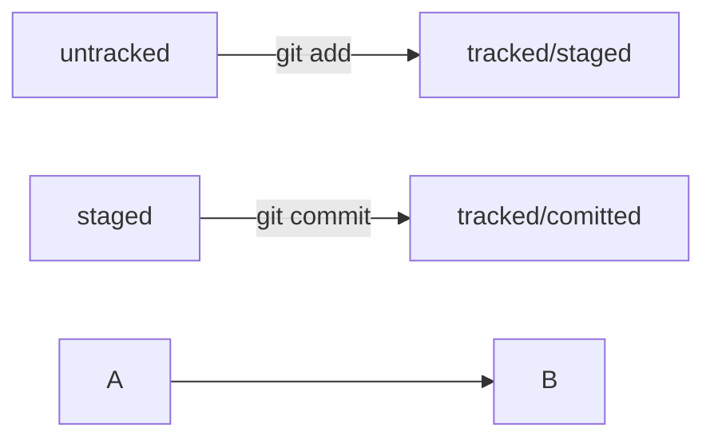

Статусы файлов:

```mermaid
%% описание схемы

graph LR;
  untracked -- "git add"    --> tracked/staged;
  staged    -- "git commit" --> tracked/comitted;

%% стрелка без текста для примера: 
  A --> B;

```
